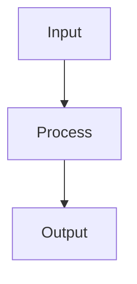

# Output Examples

Load this reference when the target Markdown shape needs a concrete page-preserving example.

## Example: Page-Preserving Heading Depth

```markdown
# Research Methods

## Sampling

Paragraph text.

### Inclusion Criteria

- Adults
- First-time participants
```

## Example: Promote Plain Text Heading Without Rewriting

```markdown
Background

The study compares two cohorts.
```

becomes

```markdown
# Background

The study compares two cohorts.
```

## Example: Promote Parallel Plain Text to a List

```markdown
Key findings
Accuracy improved
Response time decreased
Error rate stayed low
```

becomes

```markdown
# Key findings

- Accuracy improved
- Response time decreased
- Error rate stayed low
```

## Example: Keep First Header, Remove Later Repetition

```markdown
Course Notes | Week 03 | Page 1

# Regression

---

Course Notes | Week 03 | Page 2

Assumptions
Linearity
Independence
```

becomes

```markdown
Course Notes | Week 03 | Page 1

# Regression

---

# Assumptions

- Linearity
- Independence
```

## Example: Same Topic Across Two Pages Without Merging

```markdown
# Results

## Group A

- Accuracy improved
- Response time decreased

---

## Group A

Continuation paragraph for the same topic on the next page.

- Error rate stayed low
```

## Example: Quote vs. General Note

```markdown
## Prior Work

> "This framework improved retention by 12%."

General note about how the study was summarized in class.
```

## Example: Figure Caption as a Blockquote

```markdown


Figure 1. Overall model architecture and data flow.
```

becomes

```markdown


> Figure 1. Overall model architecture and data flow.
```

## Example: Paper Abstract as a Blockquote

```markdown
Abstract
This study compares two retrieval strategies across three evaluation settings.
The proposed method improves recall while preserving precision.
```

becomes

```markdown
# Abstract

> This study compares two retrieval strategies across three evaluation settings.
> The proposed method improves recall while preserving precision.
```

## Example: Recoverable Table Repair

```markdown
| Item | Detail |
| --- | --- |
| A | Description |
| B | More detail |
```

## Example: Recoverable Mermaid Repair

````markdown

````

## Example: Basic Frontmatter

```yaml
---
tags: [notes, cleaned]
previous_lecture: ""
next_lecture: ""
related_notes: []
updated: "YYYY-MM-DD"
---
```
